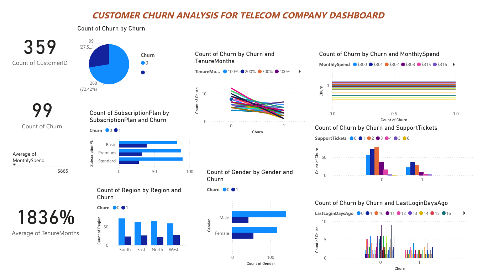

# Customer-Churn-Analysis-for-Telecom-Company
A comprehensive project on analyzing customer churn behavior in a telecom company using Python (Pandas, Seaborn, Matplotlib), SQL, Excel, and Power BI. This end-to-end solution includes data cleaning, exploratory analysis, SQL insights, dashboard development, and business recommendations to help reduce churn and improve customer retention.

# Project Overview
**Goal:** Analyze customer churn trends, uncover key factors driving churn, and provide actionable insights and recommendations for business stakeholders.

**Tools:** Python (Jupyter Notebook), Pandas, NumPy, Seaborn, Matplotlib, SQL (SQLite), Excel, Power BI.

# Objectives
Perform data cleaning, preprocessing, and exploratory analysis.

Identify patterns and features correlated with customer churn.

Visualize churn metrics with charts and dashboards.

Generate actionable business insights and targeted recommendations to reduce churn.

# Project Structure
**Data.csv / churn_data.xlsx / churn_details.csv:** Data sources containing customer demographics and service metrics.

**CustomerChurn_EDA.ipynb:** Jupyter notebook for data cleaning and exploratory data analysis.

**CustomerChurn_Queries.sql:** SQL queries for generating churn rates, averages, and segmentation insights.

**CUSTOMER-CHURN-ANALYSIS-FOR-TELECOM-COMPANY-DASHBOARD.pdf:** Power BI dashboard and visualizations.

**CustomerChurn_Insights.pdf:** Key findings and business recommendations.

**setup.sql and run_sqlite.bat:** Scripts to initialize SQLite database and run queries.

**README.md:** Project documentation for GitHub.

# Tech Stack
**Python libraries:** Pandas, NumPy, Seaborn, Matplotlib

**Jupyter Notebook:** Data analysis and visualization

**SQL (SQLite):** Querying and analysis

**Excel:** Quick pivot table KPIs and dashboarding

**Power BI:** Interactive dashboarding and business intelligence

# Key Analysis
Churn rate overall, by gender, region, and subscription plan

Monthly spend and tenure distributions for churned vs stayed customers

**Correlation analysis:** Features impacting churn (e.g., monthly spend, tenure, support tickets)

**Segmentation:** High-spend and long-tenure customers

**Interactive dashboards:** Churn breakdowns, KPIs, and filters

# Insights & Outcomes
**Churn Rate:** 25–30% of customers churned, highest in Premium plans and in the West region.

**Key Drivers:**

High-spending customers showed higher churn; even loyal, high-lifetime-value users left, highlighting dissatisfaction.

Lower tenure (new customers <12 months) were the most likely to churn.

More support tickets correlated with increased churn likelihood.

# Recommendations

Focus on early customer experience and onboarding.

Prioritize retention of premium and high-spending customers with targeted offers.

Improve support service quality.

Enhance digital payment method convenience.

 # Contact / License

**LinkedIn:** https://www.linkedin.com/in/supriya-anne-a2853a284/

